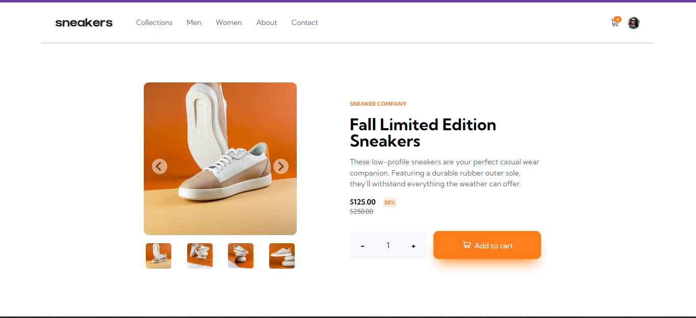

# Frontend Mentor - E-commerce product page solution

This is a solution to the [E-commerce product page challenge on Frontend Mentor](https://www.frontendmentor.io/challenges/ecommerce-product-page-UPsZ9MJp6).

## Table of contents

- [Overview](#overview)
  - [The challenge](#the-challenge)
  - [Screenshot](#screenshot)
  - [Links](#links)
  - [Built with](#built-with)
  - [What I learned](#what-i-learned)
  - [Continued development](#continued-development)
  - [Useful resources](#useful-resources)
- [Author](#author)
- [Acknowledgments](#acknowledgments)

**Note: Delete this note and update the table of contents based on what sections you keep.**

## Overview

This a single page ecommerce landing page build out using HTML, CSS and Vanilla JavaScript. The links on the page goes nowhere; however, the image sliders and shopping cart are functional.

### The challenge

Users should be able to:

- View the optimal layout for the site depending on their device's screen size
- See hover states for all interactive elements on the page
- Open a lightbox gallery by clicking on the large product image
- Switch the large product image by clicking on the small thumbnail images
- Add items to the cart
- View the cart and remove items from it

### Screenshot

### Links

- Solution URL: [GitHub](https://github.com/SashanaFarrier/ecommerce-landing-page)
- Live Site URL: [GitHub Pages](https://sashanafarrier.github.io/ecommerce-landing-page/)

### Built with

- Semantic HTML5 markup
- CSS custom properties
- Flexbox
- Mobile-first workflow

### What I learned

This was my first time working on an ecommerce page. There are many things I didn't know and had to learn about in building out this project. The greatest challenge I faced was when it came to adding functionality to the shopping cart, which included adding to and/or removing items from the cart and updating same.

I learnt a lot about localStorage and how implement its uses when building out my shopping cart.

I also learnt how to build an image slider without the help of any libraries.

Overall, my knowledge base has expanded and I am grateful for opportunity to have completed this project.

### Continued development

I want to continue building ecommerce pages and image sliders until I fully understand how to work with them.

### Useful resources

**[freeCodeCamp](https://youtu.be/cT_ZYrS3tKc)** - This has helped me a lot in understanding how to build out the functionality of a shopping cart. The totorial was easy to understand and follow. I will refer back to this for future use.

## Author

Frontend Mentor - [@SashanaFarrier](https://www.frontendmentor.io/profile/sashanaFarrier)

## Acknowledgments

I want to give thanks to all the resources and learning platforms out there. YouTube has been my main learning platform and it has helped me a lot in finding the right resources/persons who would be able to guide me along the way.
